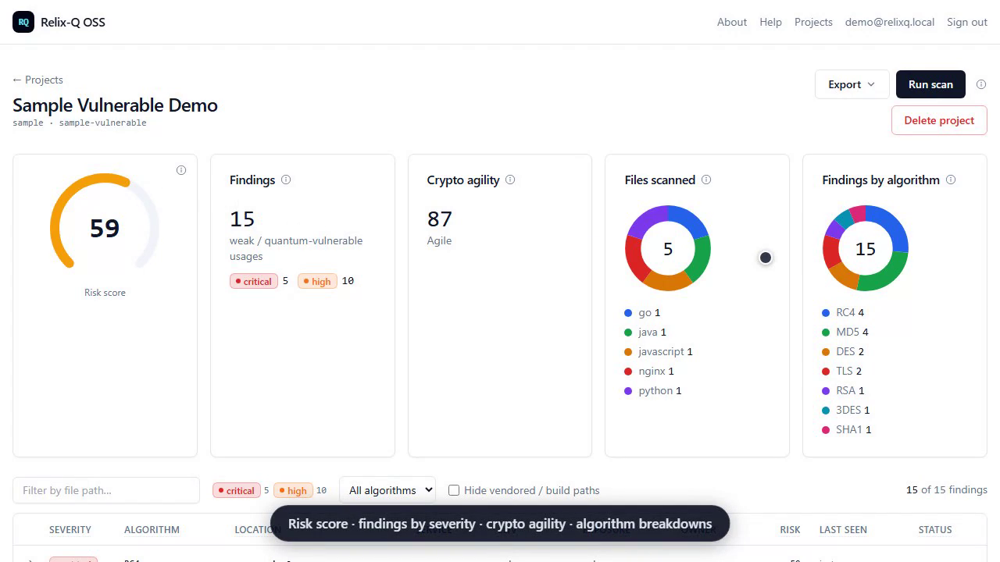

<div align="center">

# Relix-Q OSS

### Find the cryptography quantum computers will break — before they break it.

**The open-source Post-Quantum Cryptography (PQC) scanner.** Build a cryptographic inventory of the **quantum-vulnerable** algorithms — RSA, ECDSA, ECDH, DSA, Diffie-Hellman — that Shor's algorithm defeats, plus the classically-broken MD5 / SHA-1 / RC4 / DES baseline, across your **source code, dependencies, TLS endpoints, certificates, and configs**. Score the risk, grade your **crypto-agility**, gate CI with **SARIF 2.1.0**, and point every quantum-vulnerable finding at its **NIST post-quantum replacement** — ML-KEM / ML-DSA (FIPS 203 / 204 / 205).

*30+ languages · 47 rule packs · 725 rules · self-hosted · Apache-2.0 — **your code never leaves your machine.***

⚛️ *"Harvest now, decrypt later" has already begun: adversaries store your RSA/ECC-protected data today to decrypt it the day a quantum computer can. Relix-Q surfaces that exposure now.*


</div>

<div align="center">
  <a href="docs/relixq-demo.mp4">
    
  </a>
  <br>
  <strong>▶ <a href="docs/relixq-demo.mp4">Watch the 1-minute tour</a></strong> — scan → risk score → crypto-agility grade → per-finding fix guidance.
</div>

---

## Contents

- [What it is](#what-it-is)
- [Quick start](#quick-start) — [scan from the CLI](#scan-from-the-cli-no-clone) · [run the web UI](#run-the-web-ui-docker-compose)
- [What it scans](#what-it-scans)
- [CI integration](#ci-integration)
- [How it works](#how-it-works)
- [Configuration](#configuration)
- [Scope of this repo](#scope-of-this-repo)
- [Docs & community](#docs--community)
- [License](#license)

---

## What it is

Relix-Q OSS scans your **source code, dependencies, and TLS endpoints** for cryptography that a quantum computer will break (RSA, ECDSA, DH, …) and for the classically-weak baseline (MD5, SHA-1, RC4, DES). Each scan produces a **risk score**, a **crypto-agility grade** that predicts migration cost, and findings down to the exact file and line — exportable as **SARIF** for CI gating or reviewed in a **self-hosted web UI**. Your code never leaves your machine.

---

## Quick start

Two ways in: the **CLI** for a fast scan in CI or a terminal, or the **web UI** for an interactive dashboard.

### Scan from the CLI (no clone)

No clone, no build, no Docker. Grab the archive for your platform from
[**Releases**](https://github.com/xops-labs/relixq-oss/releases/latest), extract, and scan —
the `relixq` CLI, the scanner engine, and the community rules are bundled together, so one
command works out of the box. (Replace `0.1.0` with the latest release version.)

**Windows (PowerShell)** — or use the `.msi` installer, which puts `relixq` on your `PATH`:

```powershell
$V = "0.1.0"
irm "https://github.com/xops-labs/relixq-oss/releases/download/v$V/relixq_${V}_windows_amd64.zip" -OutFile relixq.zip
Expand-Archive relixq.zip -DestinationPath "$env:LOCALAPPDATA\RelixQ"
& "$env:LOCALAPPDATA\RelixQ\relixq.exe" scan C:\path\to\your\repo
```

**macOS / Linux** — archives: `linux_amd64`, `darwin_amd64` (Intel), `darwin_arm64` (Apple Silicon):

```bash
V=0.1.0
curl -fsSLO "https://github.com/xops-labs/relixq-oss/releases/download/v$V/relixq_${V}_linux_amd64.tar.gz"
mkdir -p ~/relixq && tar -xzf "relixq_${V}_linux_amd64.tar.gz" -C ~/relixq
~/relixq/relixq scan /path/to/your/repo
```

> macOS: release binaries are not yet notarized — run
> `xattr -d com.apple.quarantine ~/relixq/relixq ~/relixq/relixq-scan-code` after extracting.
> Debian/Ubuntu and RHEL/Fedora users can install the `.deb`/`.rpm` instead
> (`sudo dpkg -i relixq_${V}_amd64.deb` / `sudo rpm -i relixq-${V}-1.x86_64.rpm`).

**Docker** — the released scanner image (no download at all):

```bash
docker run --rm -v "$PWD:/src" ghcr.io/xops-labs/relixq:latest scan /src
```

Useful next flags: `--format sarif|json|html`, `--severity-threshold high`, `--exit-on high`
(CI gating), `relixq scan deps`, `relixq scan tls host:443`, `relixq version`, `relixq doctor`.
Every release ships SHA256 checksums; container images are cosign-signed (see [`docs/RELEASE.md`](docs/RELEASE.md)).

### Run the web UI (Docker Compose)

A fresh clone runs end-to-end — Postgres + API + web — with one command:

```bash
git clone https://github.com/xops-labs/relixq-oss relix-q-oss
cd relix-q-oss
cp .env.example .env        # optional — defaults work unedited
docker compose up --build   # builds postgres + api + web
```

Then open **http://localhost:47000** and:

1. **Sign up** with an email + password (one shared workspace; no external IdP).
2. **Create a project** — scan the bundled intentionally-vulnerable sample, or paste a public git URL.
3. **Run scan** — the API loads the source, runs the scanner engine, and scores each finding.
4. **See results** — a risk-score gauge, a crypto-agility grade, language/algorithm breakdowns, and a findings table.

> **Demo login:** `admin@relixq.local` / `RelixqPQC-demo-2026` — there's no seeded account; create this once via **Sign up** (or use any email/password). The bundled sample (`fixtures/sample-vulnerable/`) produces findings deterministically, so the demo works offline.

---

## What it scans

| Surface | What's flagged |
|---|---|
| **Source code** | Quantum-broken asymmetric crypto (RSA, ECDSA, ECDH, DSA, Ed25519, DH, JWT algorithms) and the weak-crypto baseline (MD5, SHA-1, RC4, DES, 3DES, TLS 1.0/1.1, hardcoded keys) across **47 rule packs / 725 rules**. Regex floor + AST detectors for 13 languages (C# via Roslyn). |
| **Dependencies** | Declared third-party packages that ship quantum-vulnerable crypto, via an embedded knowledge base — Python / JS / Go manifests (`relixq scan deps`). |
| **TLS endpoints** | Live certificate keys (RSA/ECDSA/DSA), weak protocols, SHA-1 signatures, and expiring / self-signed certs (`relixq scan tls host:443`). |
| **Certificates & keys** | Standalone `.pem` / `.crt` / `.cer` / `.der` / `.key` files — flagged on both public-key and signature algorithm; snippets carry only the `-----BEGIN …-----` marker, never key material. |
| **Config-layer crypto** | OpenSSH (`sshd_config` / `ssh_config`: host keys, `KexAlgorithms`, `Ciphers`) and nginx (`ssl_protocols`, `ssl_ciphers`). |
| **Hand-rolled crypto** | Implementations with no import to match — a constant-fingerprint pack (AES S-boxes, SHA-256 constants, RSA/DH/curve primes); ≥2 agreeing signals fuse into one high-severity `HANDROLLED_<ALG>_PROMOTED` finding. |

Every finding's `quantum_safety` field separates three risk tiers — `vulnerable` (Shor-broken asymmetric), `grover_weakened` (AES-128 / 3DES-class), `classically_broken` (MD5 / SHA-1 / RC4 / DES) — so the quantum inventory stays distinct from the legacy weak-crypto baseline in JSON and SARIF. When a file imports a known crypto library but no rule matches, an informational `CRYPTO_API_UNMAPPED` sentinel surfaces the blind spot instead of staying silent (PQC libraries excluded).

### Scan your own code

In the web app, a project can come from one of four sources:

- **Git repository** — paste an `http(s)` URL; the API shallow-clones and scans it. For a **private** repo, add a personal access token in the optional *Access token* field — stored for re-scans, sent only as an auth header to the clone, never returned by the API.
- **Local path** — code already on your machine, placed under `./scan-targets/` (mounted read-only at `/scan`; sandboxed to the mounted root). See [`scan-targets/README.md`](scan-targets/README.md).
- **Upload code (.zip)** — zip your **source only** (exclude `node_modules/`, `.git/`, build output) and upload in the browser; extracted server-side with zip-slip / zip-bomb guards (up to 1 GB).
- **Bundled sample** — the intentionally-vulnerable demo target.

Or run the engine directly, with no app or Docker:

```bash
cd packages/go
go build -o relixq-scan-code ./cmd/relixq-scan-code
./relixq-scan-code -path /path/to/repo -rules ./rules-community -output findings.jsonl -agility agility.json
```

A plain `go build` gives the regex floor plus the pure-Go AST detectors (Go, JS/TS). **Full AST** — C# (via the bundled `relixq-roslyn` subprocess) and the Tree-sitter languages (C/C++, Java, Ruby, Rust, Swift, Julia, Scala, Kotlin) — is built into the `docker compose up` image (CGO + bundled subprocess), so you get full precision with no toolchain on the host. Without them, AST silently falls back to the regex floor — never an error.

---

## CI integration

The `relixq` CLI adds CI-friendly output and noise control. With a released download this works as-is — the CLI finds `relixq-scan-code` and the bundled rules next to itself:

```bash
relixq scan /path/to/repo --format sarif > relixq.sarif   # SARIF 2.1.0 for GitHub Code Scanning
relixq scan /path/to/repo --format json  > findings.json
```

The SARIF is 2.1.0 and uploads directly to GitHub Code Scanning — `security-severity`, tags, per-rule help, and stable fingerprints.

**GitHub Action.** The bundled Action wraps this into one step — pairs with `github/codeql-action/upload-sarif` for inline PR annotations. Full example in [`docs/ci-examples/github.yml`](docs/ci-examples/github.yml):

```yaml
- uses: xops-labs/relixq-oss/github-action@v0.1.0
  with:
    scan-type: code   # code | deps | tls
```

**Suppress noise.** Skip paths with a `.relixqignore` file (gitignore syntax), or silence a line with an inline `// relixq-ignore: RULE_ID` comment.

**Baselines.** Adopt the scanner on an existing codebase without drowning in the backlog — record current findings, commit the file, then gate CI on *new* findings only:

```bash
relixq baseline /path/to/repo            # writes .relixq-baseline.json
relixq scan     /path/to/repo --baseline .relixq-baseline.json
```

**Dependencies & TLS** share the same `--format` / `--severity-threshold` / `--baseline` pipeline:

```bash
relixq scan deps /path/to/repo --format sarif > deps.sarif
relixq scan tls  example.com:443
relixq scan tls  --targets hosts.txt --format sarif > tls.sarif
```

---

## How it works

### Architecture

Three containers, one Docker network, nothing external:

```
  browser ──▶ web (Next.js)  ──▶  api (.NET)  ──▶  postgres
                                     │
                                     └─ shells the Go scanner engine
                                        (relixq-scan-code) against the
                                        project source, scores findings
```

- **`apps/web`** — Next.js app. Consumes `@relix-q/web-components` (finding table / score gauge) and talks to the API.
- **`apps/api`** — ASP.NET minimal API. Consumes the OSS libraries directly: `RelixQ.Auth.Local` (signup/login), `RelixQ.Scoring` (risk score), `RelixQ.Contracts` (the `CryptoFinding` shape). Shells the Go engine to scan.
- **`packages/go`** — the scanner engine, the `relixq` CLI, the dependency + TLS scanners, and the rule packs. The `docker compose` image builds it **with CGO** for full AST; a plain `go build` falls back to regex + pure-Go AST.

The scanner is regression-gated by a labeled ground-truth corpus (`fixtures/validation-corpus/` + `packages/go/validationgate`) enforcing recall, strict precision, and zero false positives on PQC code. Rules carry inline `match` / `no_match` self-tests, mandatory for new regex rules via a one-way ratchet. CI runs the full Go test suite before every merge and release.

### Repository layout

```
apps/api/                 .NET minimal API (auth, projects, scans, scoring)
apps/web/                 Next.js web app
packages/go/              scanner engine, relixq CLI, dep + TLS scanners, rule packs
packages/dotnet/          RelixQ.Scoring / Auth.Local / Contracts / AI.BYOK
packages/npm/             @relix-q/web-components, @relix-q/web-client
github-action/            GitHub Action (action.yml + entrypoint) for CI scans
docs/                     architecture, development, release docs, CI examples
fixtures/sample-vulnerable/  bundled demo scan target
packaging/               WiX / chocolatey / winget installers
.goreleaser.yaml          release build matrix: archives, deb/rpm, checksums
docker-compose.yml        postgres + api + web
```

---

## Configuration

All values default sensibly (see `.env.example`); the stack runs with no `.env`.

| Variable | Default | Purpose |
|---|---|---|
| `WEB_PORT` | `47000` | Web app host port |
| `API_PORT` | `47080` | API host port |
| `POSTGRES_PORT` | `47432` | Postgres host port |
| `LOCAL_SCAN_PATH` | `./scan-targets` | Host folder mounted read-only at `/scan` for **Local path** projects |

---

## Scope of this repo

This repository is the single-tenant, self-hosted build: the code, dependency, and TLS scanners, the scoring libraries, the CLI, the GitHub Action, and the web UI. Some capabilities are intentionally out of scope here — multi-tenant scan orchestration, SSO/RLS, cloud-posture scanning, fleet-scale dependency/TLS scanning, and runtime telemetry.

The scanner flags quantum-vulnerable cryptography and the weak-crypto baseline on its own. An optional external **rule-pack overlay** can enrich each detection finding in place with migration intelligence — NIST/FIPS substitutions (e.g. ML-DSA / FIPS 204), hybrid-PQC guidance, and vertical context — keyed by rule id. Findings stay complete and actionable without it.

---

## Docs & community

- **New contributors:** [`CONTRIBUTING.md`](CONTRIBUTING.md) and [`docs/DEVELOPMENT.md`](docs/DEVELOPMENT.md)
- **Configure & deploy:** [`docs/CONFIGURATION.md`](docs/CONFIGURATION.md), [`docs/DEPLOYMENT.md`](docs/DEPLOYMENT.md), [`docs/FAQ.md`](docs/FAQ.md)
- **Architecture & security:** [`docs/ARCHITECTURE.md`](docs/ARCHITECTURE.md), [`SECURITY_DESIGN.md`](SECURITY_DESIGN.md), [`SECURITY.md`](SECURITY.md)
- **Support & troubleshooting:** [`SUPPORT.md`](SUPPORT.md), [`docs/TROUBLESHOOTING.md`](docs/TROUBLESHOOTING.md)
- **Governance & community:** [`GOVERNANCE.md`](GOVERNANCE.md), [`MAINTAINERS.md`](MAINTAINERS.md), [`CODE_OF_CONDUCT.md`](CODE_OF_CONDUCT.md), [`ROADMAP.md`](ROADMAP.md), [`ADOPTERS.md`](ADOPTERS.md)
- **Releases & CI:** [`docs/RELEASE.md`](docs/RELEASE.md), [`docs/ci-examples/github.yml`](docs/ci-examples/github.yml)

---

## License

Apache License 2.0 — see [`LICENSE`](LICENSE).
