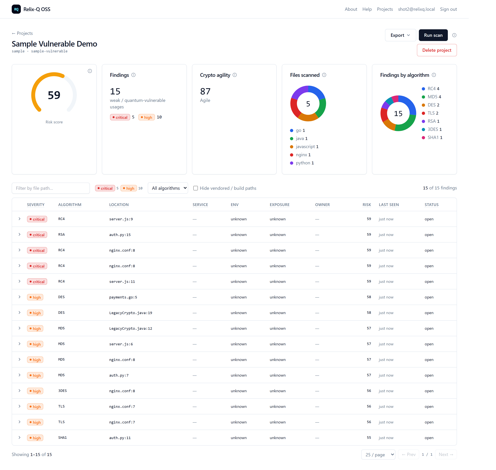

<div align="center">

# Relix-Q OSS

### Post-Quantum Cryptography Scanning · Crypto-Agility · SARIF CI · Self-Hosted

*Self-hosted, open-source post-quantum cryptography risk scanner — find quantum-vulnerable crypto across source code, dependencies, and TLS endpoints, score the risk, grade crypto-agility, gate CI with SARIF, and review findings in a web UI. So security, platform, and engineering teams can inventory and migrate their cryptography before "harvest-now, decrypt-later" becomes decrypt-now.*


</div>

<div align="center">
  
  <br>
  <em>Web UI — scan results: risk-score gauge, crypto-agility grade, language &amp; algorithm breakdowns, and a per-finding table.</em>
</div>

## Evaluate in 5 minutes — download and scan

No clone, no build, no Docker. Grab the archive for your platform from
[**Releases**](https://github.com/xops-labs/relixq-oss/releases/latest), extract, and scan —
the `relixq` CLI, the scanner engine, and the community rules are bundled together,
so one command works out of the box. (Replace `0.1.0` below with the latest release version.)

**Windows (PowerShell)** — or use the `.msi` installer, which puts `relixq` on your `PATH`:

```powershell
$V = "0.1.0"
irm "https://github.com/xops-labs/relixq-oss/releases/download/v$V/relixq_${V}_windows_amd64.zip" -OutFile relixq.zip
Expand-Archive relixq.zip -DestinationPath "$env:LOCALAPPDATA\RelixQ"
& "$env:LOCALAPPDATA\RelixQ\relixq.exe" scan C:\path\to\your\repo
```

**macOS / Linux** — archives: `linux_amd64`, `darwin_amd64` (Intel), `darwin_arm64` (Apple Silicon):

```bash
V=0.1.0
curl -fsSLO "https://github.com/xops-labs/relixq-oss/releases/download/v$V/relixq_${V}_linux_amd64.tar.gz"
mkdir -p ~/relixq && tar -xzf "relixq_${V}_linux_amd64.tar.gz" -C ~/relixq
~/relixq/relixq scan /path/to/your/repo
```

> macOS: release binaries are not yet notarized — run
> `xattr -d com.apple.quarantine ~/relixq/relixq ~/relixq/relixq-scan-code` after extracting.
> Debian/Ubuntu and RHEL/Fedora users can install the `.deb`/`.rpm` instead
> (`sudo dpkg -i relixq_${V}_amd64.deb` / `sudo rpm -i relixq-${V}-1.x86_64.rpm`).

**Docker** — the released scanner image (no download at all):

```bash
docker run --rm -v "$PWD:/src" ghcr.io/xops-labs/relixq:latest scan /src
```

**GitHub Actions** — one step in CI, with SARIF for Code Scanning
(full example: [`docs/ci-examples/github.yml`](docs/ci-examples/github.yml)):

```yaml
- uses: xops-labs/relixq-oss/github-action@v0.1.0
  with:
    scan-type: code
```

Useful next flags: `--format sarif|json|html`, `--severity-threshold high`, `--exit-on high`
(CI gating), `relixq scan deps` (dependency manifests), `relixq scan tls host:443`
(live endpoints), `relixq version`, `relixq doctor`. Every release ships SHA256
checksums (`relixq_<version>_checksums.txt`); container images are cosign-signed —
see [`docs/RELEASE.md`](docs/RELEASE.md).

## Full web UI — Docker Compose

The source-based workflow is unchanged: a fresh clone runs end-to-end with one command:

```bash
docker compose up --build
```

Then open **http://localhost:47000**, sign up, create a project, and scan.

## Quick start (web UI)

```bash
git clone <this-repo> relix-q-oss
cd relix-q-oss
cp .env.example .env        # optional — defaults work unedited
docker compose up --build   # builds postgres + api + web
```

Open http://localhost:47000 and:

1. **Sign up** with an email + password (one shared workspace; no external IdP).
2. **Create a project** — scan the bundled intentionally-vulnerable sample, or paste a public git URL.
3. **Run scan** — the API clones/loads the source, runs the scanner engine, scores each finding.
4. **See results** — a risk-score gauge, a crypto-agility grade, and a findings table.

> **Demo login:** `admin@relixq.local` / `RelixqPQC-demo-2026`
>
> There's no seeded default account — the app uses self-signup into one shared workspace. On a fresh `docker compose up`, create this account once via **Sign up** (or use any email/password you like; these are just the demo values).

The bundled sample (`fixtures/sample-vulnerable/`) deterministically produces findings, so the demo works offline with no configuration.

## Architecture

Three containers, one Docker network, nothing external:

```
  browser ──▶ web (Next.js)  ──▶  api (.NET)  ──▶  postgres
                                     │
                                     └─ shells the Go scanner engine
                                        (relixq-scan-code) against the
                                        project source, scores findings
```

- **`apps/web`** — Next.js app. Consumes `@relix-q/web-components` (the shared finding table / score gauge) and talks to the API.
- **`apps/api`** — ASP.NET minimal API. Consumes the OSS libraries directly: `RelixQ.Auth.Local` (signup/login), `RelixQ.Scoring` (risk score), and `RelixQ.Contracts` (the `CryptoFinding` shape). Shells the Go engine to scan.
- **`packages/go`** — the scanner engine, the `relixq` CLI (code / `deps` / `tls` scans, SARIF, baselines), and the rule packs. The `docker compose` image builds it **with CGO**, so full AST (C# via Roslyn + the tree-sitter languages) runs alongside the regex floor; a plain `go build` (no CGO) falls back to regex + pure-Go Go/JS/TS/PHP AST.
- **`packages/dotnet`, `packages/npm`** — shared OSS libraries. The app consumes `RelixQ.Auth.Local`, `RelixQ.Scoring`, `RelixQ.Contracts`, and `@relix-q/web-components`.
  `RelixQ.AI.BYOK` and `@relix-q/web-client` are standalone reusable packages.

## Repo layout

```
apps/api/                 .NET minimal API (auth, projects, scans, scoring)
apps/web/                 Next.js OSS web app
packages/go/              scanner engine, relixq CLI, dep + TLS scanners, rule packs
packages/dotnet/          RelixQ.Scoring / Auth.Local / Contracts / AI.BYOK
packages/npm/             @relix-q/web-components, @relix-q/web-client
github-action/            GitHub Action (action.yml + entrypoint) for CI scans
docs/                     architecture, development, troubleshooting, release docs, CI examples
.github/                  PR/main CI, issue/PR templates, CODEOWNERS, Dependabot
fixtures/sample-vulnerable/  bundled demo scan target
packaging/windows/        WiX authoring for the Windows .msi installer
.goreleaser.yaml          release build matrix: archives, deb/rpm, checksums
Dockerfile.scanner        slim scanner image for CI / the GitHub Action
docker-compose.yml        postgres + api + web
```

## Project docs

- New contributors: [`CONTRIBUTING.md`](CONTRIBUTING.md) and [`docs/DEVELOPMENT.md`](docs/DEVELOPMENT.md)
- Configure and deploy: [`docs/CONFIGURATION.md`](docs/CONFIGURATION.md), [`docs/DEPLOYMENT.md`](docs/DEPLOYMENT.md), and [`docs/FAQ.md`](docs/FAQ.md)
- Architecture and security model: [`docs/ARCHITECTURE.md`](docs/ARCHITECTURE.md), [`SECURITY_DESIGN.md`](SECURITY_DESIGN.md), and [`SECURITY.md`](SECURITY.md)
- Support and troubleshooting: [`SUPPORT.md`](SUPPORT.md) and [`docs/TROUBLESHOOTING.md`](docs/TROUBLESHOOTING.md)
- Governance and community: [`GOVERNANCE.md`](GOVERNANCE.md), [`MAINTAINERS.md`](MAINTAINERS.md), [`CODE_OF_CONDUCT.md`](CODE_OF_CONDUCT.md), [`ROADMAP.md`](ROADMAP.md), and [`ADOPTERS.md`](ADOPTERS.md)
- Releases and CI examples: [`docs/RELEASE.md`](docs/RELEASE.md) and [`docs/ci-examples/github.yml`](docs/ci-examples/github.yml)

## Configuration

All values default sensibly (see `.env.example`); the stack runs with no `.env`.

| Variable | Default | Purpose |
|---|---|---|
| `WEB_PORT` | `47000` | Web app host port |
| `API_PORT` | `47080` | API host port |
| `POSTGRES_PORT` | `47432` | Postgres host port |
| `LOCAL_SCAN_PATH` | `./scan-targets` | Host folder mounted read-only at `/scan` for **Local path** projects |

## Scanning your own code

When creating a project, pick one of three sources:

- **Git repository** — paste an `http(s)` git URL; the API shallow-clones and scans it. For a **private** repo, also paste a personal access token in the optional *Access token* field. It's stored (so re-scans work) and sent only as an HTTP auth header to the clone — never returned by the API or written into the clone's remote.
- **Local path** — scan code already on your machine. Put it under `./scan-targets/` (mounted read-only into the API at `/scan`), then enter the subfolder name; leave it blank to scan everything there. Point the mount elsewhere with `LOCAL_SCAN_PATH` in `.env`. Paths are sandboxed to the mounted root. See [`scan-targets/README.md`](scan-targets/README.md).
- **Upload code (.zip)** — no mount or git needed: zip your project and upload it in the browser. The API extracts it (with zip-slip / zip-bomb guards) and scans it; the archive is kept in a Docker volume so re-scans don't need a re-upload. Zip your **source only** — exclude `node_modules/`, `.git/`, and build output — to stay under the 1 GB limit.
- **Bundled sample** — the intentionally-vulnerable demo target.

You can also run the engine directly, with no app or Docker:

```bash
cd packages/go
go build -o relixq-scan-code ./cmd/relixq-scan-code
./relixq-scan-code -path /path/to/repo -rules ./rules-community -output findings.jsonl -agility agility.json
```

A plain `go build` gives the regex floor plus the pure-Go AST detectors (Go, JS/TS). **Full AST** — C# (via the bundled `relixq-roslyn` subprocess) and the Tree-sitter languages (C/C++, Java, Ruby, Rust, Swift, Julia, Scala, Kotlin) — comes built into the `docker compose up` image: the engine is compiled with CGO and the C# subprocess is bundled, so you get full precision with no toolchain on the host. To build it locally instead, use `CGO_ENABLED=1` with a C toolchain and point `RELIXQ_ROSLYN_BIN` at a published `relixq-roslyn`. Without those, AST silently falls back to the regex floor — never an error. A few detections are AST-tier only (e.g. AES-128 key-size discrimination in Python) and fire only when their AST runner is active.

Scan coverage goes beyond application source. Standalone **certificate and key files** (`.pem` / `.crt` / `.cer` / `.der` / `.key`) are parsed — PEM blocks and raw DER — and certificates are flagged on **both** the public-key and the signature algorithm; CSRs, private keys, and public keys are covered too, and snippets carry only the `-----BEGIN …-----` marker line, never key material. **Config-layer crypto** includes OpenSSH (`sshd_config` / `ssh_config`: host keys, `KexAlgorithms`, `Ciphers`) and nginx (`ssl_protocols`, `ssl_ciphers` classical key exchange). Each finding's `quantum_safety` field now distinguishes three risk tiers — `vulnerable` (Shor-broken asymmetric), `grover_weakened` (AES-128 / 3DES-class symmetric), `classically_broken` (MD5 / SHA-1 / RC4 / DES) — so the quantum inventory stays separable from the legacy weak-crypto baseline in JSON and SARIF.

**Hand-rolled crypto** — implementations with no library import to match — is caught by a constant-fingerprint pack run on every file (AES S-boxes, SHA-256 round constants, RSA / DH / curve primes) plus per-language heuristics; when two or more distinct signals agree on the same algorithm in one file, the scanner promotes them into a single high-severity `HANDROLLED_<ALG>_PROMOTED` finding with fused confidence. And when a file imports a known classical crypto library but no rule recognizes any API in it, the scanner emits an informational `CRYPTO_API_UNMAPPED` coverage-sentinel finding naming the library — possible blind spots show up as findings, never as silence (PQC libraries are excluded).

The scanner is regression-gated by a labeled ground-truth corpus: `fixtures/validation-corpus/` plus `packages/go/validationgate` (`go test ./validationgate/...`) run the real scan and deps pipeline whenever the Go tests run, and enforce recall, strict precision (every finding must map to ground truth), and zero false positives on PQC code. The PR/main CI workflow (`.github/workflows/ci.yml`) and the release workflow both run the full Go test suite before merge/release. Rules themselves carry inline `match` / `no_match` self-tests, mandatory for every new regex rule via a one-way ratchet in the Go tests.

## CI output, suppression, and baselines

The `relixq` CLI wraps the engine and adds CI-friendly output and noise control. With a [released download](#evaluate-in-5-minutes--download-and-scan) this works as-is — the CLI finds `relixq-scan-code` next to itself and the bundled `rules/` folder automatically:

```bash
# Machine-readable output for CI / code scanning
relixq scan /path/to/repo --format sarif > relixq.sarif
relixq scan /path/to/repo --format json  > findings.json
```

Building from source instead? Build both binaries into one folder and the same discovery applies (or set `RELIXQ_SCANNER_BIN` / `RELIXQ_RULE_DIR` / `--rules` explicitly — explicit settings always win):

```bash
cd packages/go
go build -o bin/relixq           ./cmd/relixq
go build -o bin/relixq-scan-code ./cmd/relixq-scan-code
bin/relixq scan /path/to/repo --rules ./rules-community --format sarif > relixq.sarif
```

The SARIF is 2.1.0 and uploads directly to GitHub Code Scanning — it carries `security-severity`, tags, per-rule help, and stable fingerprints.

On GitHub, the bundled **Action** (`github-action/`) wraps this into one step — `uses: xops-labs/relixq-oss/github-action@<tag>` with `scan-type: code|deps|tls` — and pairs with `github/codeql-action/upload-sarif` for inline PR annotations. See [`docs/ci-examples/github.yml`](docs/ci-examples/github.yml).

**Suppress noise.** Skip paths with a `.relixqignore` file (gitignore syntax), or silence a single line with an inline `// relixq-ignore: RULE_ID` comment (omit the id to suppress all rules on that line).

**Baselines.** Adopt the scanner on an existing codebase without drowning in the backlog — record the current findings, commit the file, then gate CI on *new* findings only:

```bash
relixq baseline /path/to/repo            # writes .relixq-baseline.json
relixq scan     /path/to/repo --baseline .relixq-baseline.json
```

**Scan dependencies.** Beyond source code, flag declared third-party packages that ship quantum-vulnerable crypto (Python / JS / Go manifests), via an embedded knowledge base:

```bash
relixq scan deps /path/to/repo --format sarif > deps.sarif
```

**Scan TLS endpoints.** Probe live endpoints for quantum-vulnerable certificate keys (RSA/ECDSA/DSA), weak protocols (TLS 1.0/1.1), SHA-1 signatures, and expiring/self-signed certs:

```bash
relixq scan tls example.com:443
relixq scan tls --targets hosts.txt --format sarif > tls.sarif
```

## Scope of this repo

This repository is the single-tenant, self-hosted build: the code, dependency, and TLS scanners, the scoring libraries, the CLI, the GitHub Action, and the web UI. Some capabilities are intentionally out of scope here — multi-tenant scan orchestration, SSO/RLS, cloud-posture scanning, fleet-scale dependency/TLS scanning (rate-limited probing, ownership attribution, posture scoring, asset inventory), and runtime telemetry.

The scanner flags quantum-vulnerable cryptography and the weak-crypto baseline on its own. An optional external **rule-pack overlay** can enrich each detection finding in place with migration intelligence — NIST/FIPS substitutions (e.g. ML-DSA / FIPS 204), hybrid-PQC guidance, and vertical context — keyed by rule id. Findings stay complete and actionable without it.

## License

Apache License 2.0 — see [`LICENSE`](LICENSE).
